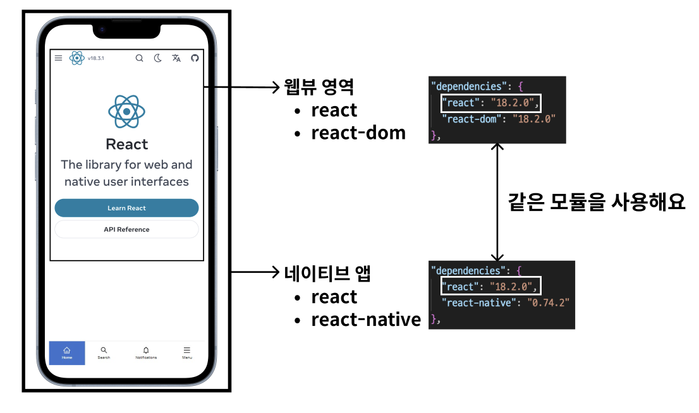
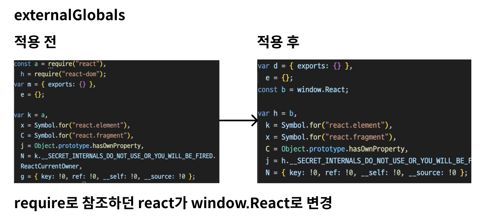
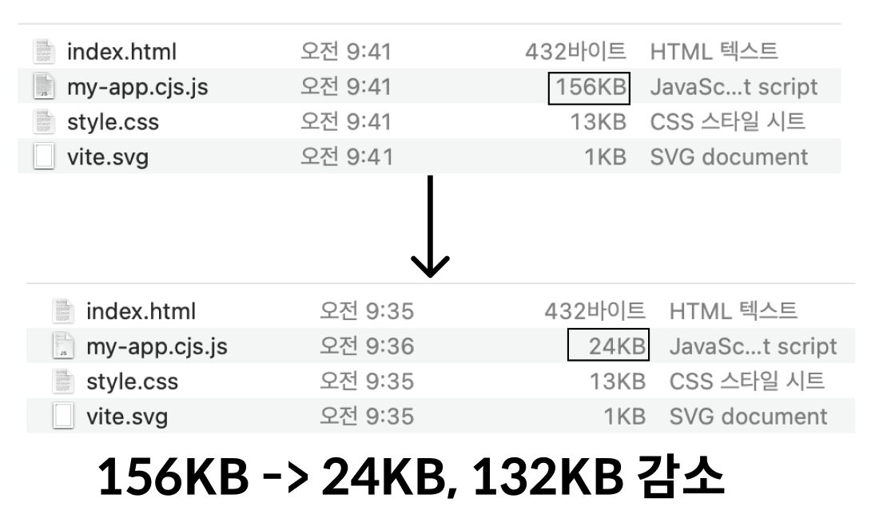

# 웹뷰 react injection으로 성능 최적화하기

빠르게 컨텐츠를 업데이트할 수 있고, 호환성이 좋은 웹은 네이티브 앱에서 웹뷰라는 형태로도 사용해요.
리액트 네이티브와 리액트를 동시에 사용하면 높은 생산성으로 앱을 업데이트할 수 있어요.

웹뷰는 앱 위에서 동작하는 웹 브라우저로, 네이티브 앱에서 웹 컨텐츠를 보여주거나, 웹 기술을 사용해 앱을 개발할 때 사용해요.
웹뷰의 브라우저에서는 네트워크 요청을 통해 번들된 리액트를 로딩하여 렌더링하게 돼요.

리액트와 리액트 네이티브를 함께 사용하는 경우 웹과 앱 모두 리액트를 사용하고 있기 때문에, 이미 앱에서 사용하는 리액트를 다시 로드하는 것은 비효율적이라고 생각했어요.



> 이미 앱에서 사용하고 있는 리액트를 웹에 주입할 수는 없을까요?

웹뷰에는 자바스크립트를 주입할 수 있는 기능이 있어요.
해당 기능을 통해 리액트와 리액트 돔을 앱에서 주입하는 방식과 네트워크를 통해 로드하는 방식의 성능을 비교해보고자 해요.

## 리액트 번들을 제외하고 빌드하기

리액트로 개발된 어플리케이션은 리액트 객체가 필요해요.
내가 작성한 컴포넌트는 리액트 객체를 필요로 하지만 꼭 함께 번들링할 필요는 없어요.

`vite`와 같은 `번들러`를 사용한다면 번들링된 리액트를 제외하고 빌드할 수 있어요.

### 리액트를 포함하여 번들링된 application

속도 비교를 위해서 온전히 리액트를 포함하여 번들링된 application을 만들었다.

```bash
pnpm create vite use-bundle --template react-ts
```

해당 application에는 100개의 버튼과 각 버튼마다 5개의 랜덤 변수가 존재한다.


### 리액트를 포함하지 않고 번들링된 application

vite config을 수정하여 번들링이 될 때 react와 react-dom을 제외하고 번들링하도록 설정했다.

react가 module이 아닌 window 객체에 주입되기 때문에 ([cdn의 코드를 사용](https://ko.legacy.reactjs.org/docs/cdn-links.html)) 변환과정에서 외부 의존성을 제외하고 번들링할 수 있게 설정하였다.


현재는 vite template 으로만 설정돼있기 때문에, react와 react-dom만을 주입 대상으로 정하였다. 추후 react-native와 함께 사용하는 공통 모듈이 있을 경우 해당 모듈도 주입 대상으로 설정할 수 있다. (예를 들어, `@tanstack/react-query`)
기존에는 리액트 모듈을 import하여 사용했지만, 모듈에 함께 번들링하지 않으니 window 객체를 참조할 수 있도록 변경해야 해요.

```ts
// vite.config.ts
export default defineConfig({
  plugins: [
    react(),
    externalGlobals([
      {
        name: "react",
        path: "index.js",
        var: "window.React",
      },
      {
        name: "react-dom",
        path: "index.js",
        var: "window.ReactDOM",
      },
    ]),
  ],
  build: {
    rollupOptions: {
      external: ["react", "react-dom"],
    },
  },
});
```



이제는 빌드된 js에는 `ReactDOM.createRoot`으로부터 생성되는 리액트 트리를 생성하는 코드만 남고, 리액트 모듈은 번들링되지 않아요.



번들된 js 파일을 확인해보면, 리액트 모듈이 번들링되지 않아 용량이 많이 줄은 것을 확인할 수 있어요.
이제는 네이티브 앱에서 리액트를 주입하여 동작시켜야 해요.

## 리액트 주입하기

> 구현의 편의를 위해 cdn의 minified 버전을 로컬에 저장하여 사용했어요.
>
> 실제로 사용하려면 metro bundler를 통해 **jsbundle**이라는 네이티브 앱에서 사용하는 확장자로 모듈을 분리하여 빌드하고, **main.jsbundle**에서 사용할 수 있도록 해야 해요.

react를 주입하기 위해 파일을 읽어와 네이티브 앱에서 주입할 수 있도록 해요.

파일을 읽는 것은 `react-native-fs`의 도움을 받아 구현할 수 있어요.

```tsx
import RNFS from "react-native-fs";

useEffect(() => {
  const readFile = async () => {
    const react = RNFS.MainBundlePath + "/react.prod.min.js";
    const reactDOM = RNFS.MainBundlePath + "/react-dom.prod.min.js";
    const react_content = await RNFS.readFile(react, "utf8");
    const reactDOM_content = await RNFS.readFile(reactDOM, "utf8");
    setReactContent(react_content);
    setReactDOMContent(reactDOM_content);
  };
  readFile();
}, []);
```

이제 읽어온 파일을 javascript로 실행할 수 있도록 `react-native-webview`의 `injectJavaScript`를 사용해요.

```tsx
<WebView
  ref={webViewRef}
  source={{
    uri: "https://test.com",
  }}
  onLoadEnd={() => {
    if (webViewRef.current) {
      webViewRef.current.injectJavaScript(
        reactContent + "\n" + reactDOMContent
      );
    }
  }}
/>
```

이제 웹에서는 주입받은 리액트로 컴포넌트를 렌더링할 수 있어요.

> 정상적으로 주입됐는지 확인하고 싶다면 `alert(JSON.stringify(window.React))`를 추가해보세요!

## 성능 비교하기

이제 네이티브 앱에서 리액트를 주입하여 웹뷰를 렌더링할 수 있게 됐어요.

네트워크를 통해 리액트를 로드하는 방식과 주입하는 방식의 성능을 비교해보고자 해요.

조건은 다음과 같아요.

1. 웹뷰에서 렌더링되는 컴포넌트는 동일하다.
2. 네트워크를 통해 리액트를 로드하는 방식은 빌드과정에 리액트를 포함한다.
3. 주입하는 방식은 빌드과정에 리액트를 포함하지 않는다.
4. 두 방식의 성능을 비교하기 위해 앱 컴포넌트가 렌더링됐을 때 시간과 렌더링을 마친 웹에서 앱으로 메시지를 전송하는 시간을 측정한다.

렌더링되는 컴포넌트는 다음과 같아요.

- 100개의 버튼 컴포넌트가 존재하고 각 버튼마다 서로 다른 css와 데이터(date, number, string, boolean)를 가지고 있어요.
- App.tsx에서 100개의 버튼 컴포넌트를 렌더링해요.


App에서는 두 개의 스크린이 존재하는데 다음과 같아요.

- 번들된 js를 로드하는 스크린
- 주입된 js를 사용하는 스크린

각 스크린에서는 로딩이 완료되면 `window.ReactNativeWebView.postMessage('LOADED')`를 호출하여 최종 로딩 시간을 측정해요.

```tsx
// react apps
useEffect(() => {
  // 렌더링 완료 후 React Native에 메시지 전달
  if (window.ReactNativeWebView) {
    window.ReactNativeWebView.postMessage("LOADED");
  }
}, []);

// react-native app
const handleWebViewMessage = (event: any) => {
  const { data } = event.nativeEvent;
  if (data === "LOADED") {
    const loadEnd = Date.now();
    setLoadEndTime(loadEnd);
  }
};
```

이제 네트워크 환경에 따라 어떤 방법이 더 빠르게 초기 렌더링을 실행하는지 확인할 수 있어요.

## 성능 테스트 측정

테스트는 10번동안 렌더링 시간을 측정해요.

네트워크 시간에 따라 영향이 클 것이기 때문에 ios 기기의 네트워크 속도를 조절할 수 있는 `Network Link Conditioner`를 사용하여 네트워크 속도를 조절했어요.

속도는 다음과 같은 기준으로 설정했어요.

> 한국의 기본 요금제를 다 사용한 후 평균 네트워크 속도는 통신사와 요금제에 따라 다르지만, 일반적으로 400Kbps에서 1Mbps 정도로 제한된다.

이를 기준으로 LTE, 1Mbps, 400Kbps의 성능을 비교해보려고 해요.

> 측정 시간 단위는 ms이에요.

#### LTE


|            | 1    | 2   | 3   | 4   | 5   | 6   | 7   | 8    | 9   | 10  | 평균  |
| ---------- | ---- | --- | --- | --- | --- | --- | --- | ---- | --- | --- | ----- |
| bundle.ver | 1105 | 763 | 743 | 812 | 720 | 755 | 846 | 1098 | 829 | 708 | 837.9 |
| inject.ver | 687  | 873 | 836 | 702 | 790 | 863 | 813 | 847  | 815 | 682 | 790.8 |

#### 1Mbps


|            | 1    | 2    | 3    | 4    | 5    | 6    | 7    | 8    | 9    | 10   | 평균   |
| ---------- | ---- | ---- | ---- | ---- | ---- | ---- | ---- | ---- | ---- | ---- | ------ |
| bundle.ver | 1211 | 1184 | 1321 | 1260 | 1209 | 1182 | 1231 | 1361 | 1301 | 1303 | 1249.7 |
| inject.ver | 1146 | 967  | 1069 | 1002 | 1033 | 1050 | 971  | 1043 | 1042 | 1093 | 1041.6 |

#### 400kbps


|            | 1    | 2    | 3    | 4    | 5    | 6    | 7    | 8    | 9    | 10   | 평균   |
| ---------- | ---- | ---- | ---- | ---- | ---- | ---- | ---- | ---- | ---- | ---- | ------ |
| bundle.ver | 3900 | 2995 | 4188 | 1541 | 1455 | 1433 | 1412 | 1344 | 1173 | 1191 | 2063.2 |
| inject.ver | 973  | 977  | 1012 | 995  | 1387 | 1005 | 948  | 1002 | 951  | 1035 | 1028.5 |

### 테스트 요약

첫 로딩 속도에서 bundle.ver이 상대적으로 느리다가 점점 dns에 캐시가 되면서 빨라지는 것을 확인할 수 있어요.

inject를 하는 경우에는 dns에 캐시가 되어있는지 여부와 상관없이 빠른 것을 확인할 수 있어요.

#### 테스트 동영상

첫 로딩에는 앱 로딩으로 인해 시간이 소요되기 때문에 두 번째 로딩부터 측정했어요.

  <!-- <video src="./assets/test-simul.mp4" width="320" height="240" controls></video> -->


## 결과

지금까지 리액트를 함께 번들하는 방식과 주입하는 방식의 성능을 비교해보았어요.

네트워크 속도에 따라 성능이 달라지지만, 주입하는 방식이 조금 더 빠른 것을 확인할 수 있었어요.

만일, 네이티브 앱과 웹에서 동일한 라이브러리와 버전을 사용한다면 번들링하는 것보다 주입하는 방식을 사용하는 것이 더 효율적일 수 있어요.

성능을 최대한 극대화하려면 `모노레포`환경에서 같은 함수나 컴포넌트를 사용하고, 공통된 라이브러리를(**@tanstack/react-query**, **recoil** 등) 사용하면 더 효율적일 수 있어요.

하지만 이 방법에는 장점만 있는 것은 아니에요.

- **과한 엔지니어링**
  네이티브 앱에서 js 모듈들은 Hermes를 통해 런타임에서 실행돼요. 이때, Metro 번들러를 통해 번들된 js를 네이티브에서 로드하며 실행하는데, Android는 index.android.bundle, iOS는 main.jsBundle과 같은 파일로 생성돼요.
  모든 번들 파일을 주입하지 않기 때문에

  1. 번들 파일을 분리한다.
  2. 네이티브 앱에서는 번들된 파일을 합쳐서 사용한다.
  3. 웹에서는 필요한 번들을 주입받는다.

     위와 같은 복잡한 과정을 거쳐야 하는데 이미 웹과 앱의 영역에서 수정을 해야 하는 문제가 생긴다.

- **웹에서의 의존성**
  만일 웹에서도 서비스를 지원하고 있다면 리액트와 같은 모듈들을 현재 os에 따라 cdn으로 다운로드 해야 해요. 이는 버전이나 최적화에 어려움이 생겨요.

이렇게 최적화를 하는 것은 결국 리액트 네이티브 앱 전체에 적용하고 느린 인터넷 환경에서는 효과적이지만, 네트워크가 충분히 빠른 환경에서는 성능 차이가 미미한 반면에 (100ms 이하) 오버 엔지니어링을 하게 되고 웹의 구성에도 영향을 미친다는 단점이 생기 때문에 신중하게 결정해야 해요.
