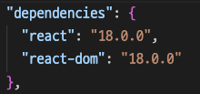
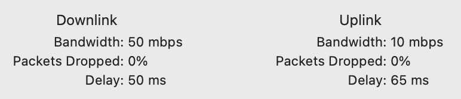
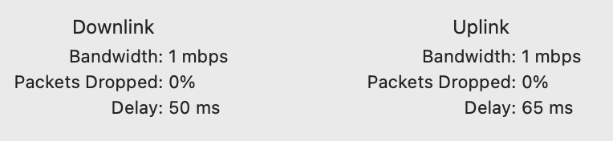
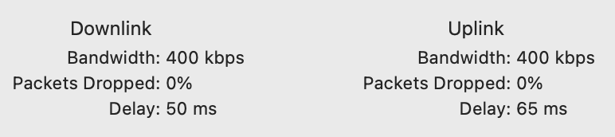

# 웹뷰 react injection으로 성능 최적화

## 문제정의

- 웹 서비스가 React로 개발된 경우
- React-Native를 사용하는 경우

위 두 경우에는 dependency로 `react`를 포함하고 있다.
React-Native 앱에서 웹뷰를 제공하는 경우 웹뷰의 브라우저에서 번들된 리액트를 네트워크를 통해 로딩하게 되는데, 이미 앱에서 react를 사용하는데 내장된 react를 로드하지 않고 불필요한 네트워크 요청을 하고 있다는 것을 알 수 있다.

> 네트워크 요청을 줄임으로써, 성능을 향상시킬 수 있을 것이라고 기대했다.
> 또한, 웹뷰를 많이 사용할 수록 효과적일 것이라고 생각했다.

react와 react-dom을 앱에서 주입하는 방식과 네트워크를 통해 로드하는 방식의 성능을 비교해보고자 한다.

## react 번들 injection 시도

### 환경 설정

해당 아이디어를 구현하기 위해 3가지 react application이 필요하다.

1. 리액트를 포함하여 번들링된 application
2. 리액트를 포함하지 않고 번들링된 application
3. webview를 사용하는 react-native 앱

### 리액트를 포함하여 번들링된 application

속도 비교를 위해서 온전히 리액트를 포함하여 번들링된 application을 만들었다.

```bash
pnpm create vite use-bundle --template react-ts
```

해당 application에는 100개의 버튼과 각 버튼마다 5개의 랜덤 변수가 존재한다.


### 리액트를 포함하지 않고 번들링된 application

vite config을 수정하여 번들링이 될 때 react와 react-dom을 제외하고 번들링하도록 설정했다.

react가 module이 아닌 window 객체에 주입되기 때문에 ([cdn의 코드를 사용](https://ko.legacy.reactjs.org/docs/cdn-links.html)) 변환과정에서 외부 의존성을 제외하고 번들링할 수 있게 설정하였다.



현재는 vite template 으로만 설정돼있기 때문에, react와 react-dom만을 주입 대상으로 정하였다. 추후 react-native와 함께 사용하는 공통 모듈이 있을 경우 해당 모듈도 주입 대상으로 설정할 수 있다. (예를 들어, `@tanstack/react-query`)

```ts
import react from "@vitejs/plugin-react";
import path from "path";
import { defineConfig } from "vite";
import externalGlobals from "vite-plugin-external-globals";

export default defineConfig({
  plugins: [
    react(),
    externalGlobals({
      injectTo: "body",
      integrity: true,
      crossorigin: "anonymous",
      entry: [
        {
          name: "react",
          path: "index.js",
          var: "window.React",
        },
        {
          name: "react-dom",
          path: "index.js",
          var: "window.ReactDOM",
        },
      ],
    }),
  ],
  define: {
    "process.env.NODE_ENV": JSON.stringify("production"),
  },
  build: {
    lib: {
      entry: path.resolve(__dirname, "src/App.tsx"),
      name: "MyApp",
      formats: ["cjs"],
      fileName: (format) => `my-app.${format}.js`,
    },
    rollupOptions: {
      input: {
        index: path.resolve(__dirname, "index.html"),
      },
      external: ["react", "react-dom"],
      output: {
        globals: {
          react: "React",
          "react-dom": "ReactDOM",
        },
      },
    },
  },
});
```

`externalGlobals` 라이브러리가 의존성을 window 객체로 변환해주지만, index.html에 cdn script를 추가하는 문제가 있어 `custom-index.html`을 추가하여 빌드된 이후에 사용할 수 있게 빌드 script를 추가하였다.

```json
"postbuild": "cp custom-index.html dist/index.html"
```

또한, 페이지 로딩 시 react가 없기 때문에 js를 로딩하지 않는 id="root"만을 포함하는 index.html으로 수정하였다.

### webview를 사용하는 react-native 앱

웹뷰는 두 개의 스크린이 존재하고, 앱에서 스크린이 렌더링될 때의 시간과 웹뷰에서 스크린이 렌더링됐을 때의 시간을 측정하여 렌더링까지 걸리는 시간을 비교하였다.

```tsx
<Tab.Navigator>
  <Tab.Screen name="USE-REACT" component={UseReact} />
  <Tab.Screen name="NOT-USE-REACT" component={NotUseReact} />
</Tab.Navigator>
```

각 스크린에서는 로딩이 완료되면 `window.ReactNativeWebView.postMessage('LOADED')`를 호출하여 로딩 시간을 측정하였다.

```tsx
// react apps
useEffect(() => {
  // 렌더링 완료 후 React Native에 메시지 전달
  if (window.ReactNativeWebView) {
    window.ReactNativeWebView.postMessage("LOADED");
  }
}, []);

// react-native app
const handleWebViewMessage = (event: any) => {
  const { data } = event.nativeEvent;
  if (data === "LOADED") {
    const loadEnd = Date.now();
    setLoadEndTime(loadEnd);
  }
};
```

#### USE-REACT

리액트를 포함하여 번들링된 application을 vercel을 통해 배포해두고 해당 url을 웹뷰로 렌더링하였다.

```tsx
<WebView
  source={{
    uri: "https://webview-inject-test-fsw7.vercel.app",
  }}
  onLoadStart={() => setLoadStartTime(Date.now())}
/>
```

따라서, 웹뷰에서 로딩이 시작되면 `onLoadStart` 이벤트가 발생하고, 앱에서 로딩이 완료되면 `onLoadEnd` 이벤트가 발생하는 시간으로 렌더링 시간을 측정하였다.

#### NOT-USE-REACT

리액트를 포함하지 않고 번들링된 application을 vercel을 통해 배포해두고 해당 url을 웹뷰로 렌더링하였다.

또한, `react와 react-dom`을 `MainBundlePath`에 저장해두고 해당 파일을 읽어와서 `injectedJavaScript`로 주입하였다.

```tsx
useEffect(() => {
  const readFile = async () => {
    const react = RNFS.MainBundlePath + "/react.prod.min.js";
    const reactDOM = RNFS.MainBundlePath + "/react-dom.prod.min.js";
    const react_content = await RNFS.readFile(react, "utf8");
    const reactDOM_content = await RNFS.readFile(reactDOM, "utf8");
    setReactContent(react_content);
    setReactDOMContent(reactDOM_content);
  };
  readFile();
}, []);

const injectedJavaScript = `
    (function() {
      const existingScript = document.createElement('script');
      existingScript.type = 'module';
      existingScript.crossOrigin = 'anonymous';
      existingScript.src = "./my-app.cjs.js";
      document.head.appendChild(existingScript);
      document.addEventListener('DOMContentLoaded', function() {
        window.ReactNativeWebView.postMessage('LOADED');
      });
    })();
    true;
  `;

return (
  <WebView
    ref={webViewRef}
    source={{
      uri: "https://webview-inject-test.vercel.app",
    }}
    onLoadStart={() => {
      setLoadStartTime(Date.now());
    }}
    onLoadEnd={() => {
      webViewRef.current.injectJavaScript(
        reactContent + "\n" + reactDOMContent + "\n" + injectedJavaScript
      );
    }}
  />
);
```

### 성능 비교 결과

테스트는 10번의 렌더링동안의 시간을 측정하였다.
또한, 네트워크 시간에 따라 영향이 클 것이라고 판단했고 ios 기기의 네트워크 속도를 조절할 수 있는 `Network Link Conditioner`를 사용하여 네트워크 속도를 조절하였다.

속도의 기준은 다음과 같다.

> 한국의 기본 요금제를 다 사용한 후 평균 네트워크 속도는 통신사와 요금제에 따라 다르지만, 일반적으로 400Kbps에서 1Mbps 정도로 제한된다.

이를 기준으로 LTE, 1Mbps, 400Kbps의 성능을 비교하였다.

측정 시간 단위는 ms이다.

#### LTE



|            | 1    | 2   | 3   | 4   | 5   | 6   | 7   | 8    | 9   | 10  | 평균  |
| ---------- | ---- | --- | --- | --- | --- | --- | --- | ---- | --- | --- | ----- |
| bundle.ver | 1105 | 763 | 743 | 812 | 720 | 755 | 846 | 1098 | 829 | 708 | 837.9 |
| inject.ver | 687  | 873 | 836 | 702 | 790 | 863 | 813 | 847  | 815 | 682 | 790.8 |

미세하게 inject.ver가 빠른 것을 확인할 수 있다.

#### 1Mbps



|            | 1    | 2    | 3    | 4    | 5    | 6    | 7    | 8    | 9    | 10   | 평균   |
| ---------- | ---- | ---- | ---- | ---- | ---- | ---- | ---- | ---- | ---- | ---- | ------ |
| bundle.ver | 1211 | 1184 | 1321 | 1260 | 1209 | 1182 | 1231 | 1361 | 1301 | 1303 | 1249.7 |
| inject.ver | 1146 | 967  | 1069 | 1002 | 1033 | 1050 | 971  | 1043 | 1042 | 1093 | 1041.6 |

데이터 속도가 느려질 수록 inject.ver가 더 빠른 것을 확인할 수 있다.

#### 400kbps



|            | 1    | 2    | 3    | 4    | 5    | 6    | 7    | 8    | 9    | 10   | 평균   |
| ---------- | ---- | ---- | ---- | ---- | ---- | ---- | ---- | ---- | ---- | ---- | ------ |
| bundle.ver | 3900 | 2995 | 4188 | 1541 | 1455 | 1433 | 1412 | 1344 | 1173 | 1191 | 2063.2 |
| inject.ver | 973  | 977  | 1012 | 995  | 1387 | 1005 | 948  | 1002 | 951  | 1035 | 1028.5 |

첫 로딩 속도에서 bundle.ver이 매우 느리다가 점점 dns에 캐시가 되면서 빨라지는 것을 확인할 수 있었다.

inject를 하는 경우에는 dns에 캐시가 되어있는지 여부와 상관없이 빠른 것을 확인할 수 있다.

#### 테스트 동영상

첫 로딩에는 앱 로딩으로 인해 시간이 소요되기 때문에 두 번째 로딩부터 측정하였다.

  <!-- <video src="./assets/test-simul.mp4" width="320" height="240" controls></video> -->


## 결론

react를 번들로 주입하는 것으로 로딩을 빠르게 할 수 있다는 것을 알 수 있다.
특히나 네트워크 속도가 느릴 수록 inject하는 것이 효과적임을 알 수 있다.

하지만, react를 번들로 주입하는 것은 번들 사이즈를 늘리는 단점이 있다.
그리고 네트워크가 충분히 빠른 환경에서는 성능 차이가 미미한 반면에 (100ms 이하) 오버 엔지니어링을 하게 되고 웹의 구성에도 영향을 미친다는 단점이 생긴다.
